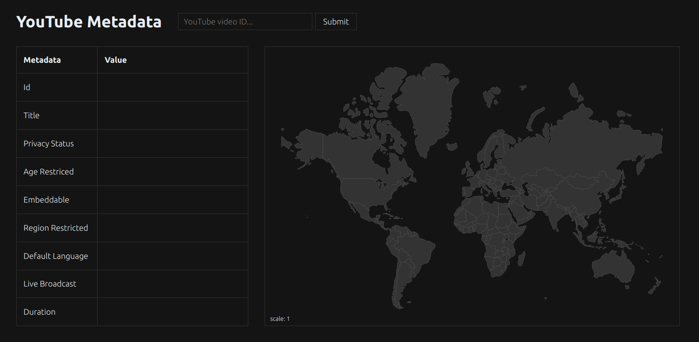

# YouTube Metadata

Supply a YouTube video URL to get some of the essential info about the video.


## Config

Create an `.env` file with `PORT` and `YOUTUBE_API_KEY` variables or export tme to your environment.


## Installation

Build both CLI and WEB binaries and start the app.
```
make run
```

Or just use `air` if you want live reloading for the app.
```
air
```

Access the web app on `localhost:<port>`.  




Use the CLI.
```
./bin/cli <url>
```

Clean up.
```
make clean
```

## Run the Web App via Docker

Build an image and run the app.
```
docker build -t yt-stats .
docker run -p <port>:<port> --env-file=.env yt-stats
```

## License

[](/LICENSE "License: MIT")